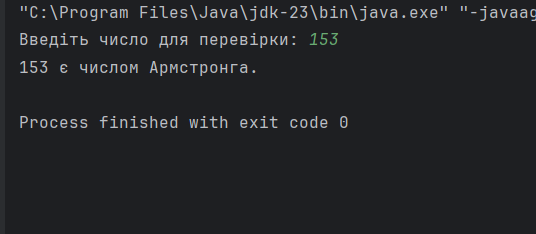

# Практична робота: Перевірка числа Армстронга

## Опис завдання
У цій практичній роботі ми реалізували програму для перевірки, чи є задане число **числом Армстронга**. Число Армстронга — це таке число, яке дорівнює сумі своїх цифр, піднесених до степеня, що дорівнює кількості цифр у числі.

### Приклад:
Для числа **153**:
\[ 1^3 + 5^3 + 3^3 = 153 \]
Отже, **153** є числом Армстронга.

## Опис структури проекту

### Клас `Exercise.java`

Цей клас містить метод **`Calculate`**, який перевіряє, чи є задане число числом Армстронга:
1. Спочатку обчислюється кількість цифр у числі.
2. Потім кожна цифра підноситься до степеня, рівного кількості цифр, і додається до суми.
3. Якщо сума дорівнює початковому числу, то число є числом Армстронга.

### Клас `TestResult.java`

Цей клас є точкою входу в програму. Він дозволяє користувачу ввести число і перевірити його на те, чи є воно числом Армстронга:
1. Програма зчитує введене користувачем число.
2. Викликається метод **`Calculate`** з класу **`Exercise`** для перевірки числа.
3. Програма виводить результат: чи є введене число числом Армстронга чи ні.

## Приклад виконання програми

